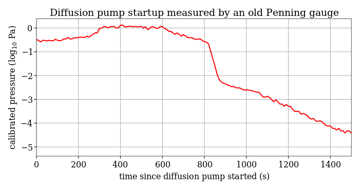

## gauge2data - record an analog gauge, get the time-resolved plot

This little script uses the [Hough transform](https://en.wikipedia.org/wiki/Hough_transform) to find the angle of the longest line in each video frame. Therefore, if you place you mobile phone in front of an old instrument and switch on the recording, you can later get the temporal evolution of the measured quantity, without tapping any wire and without exporting data from a digital oscilloscope. If you use the timelapse function, remember what is its frames-per-second rate for later scaling of the x-axis.

#### Input
An example: Assume you have recorded the 720x480 video that follows, with 0.1 FPS. (For this README, a thumbnail was created with smaller size and converted to gif.)
<!---  commands to generate it: 
ffmpeg -i test.3gp -filter:v scale=240:-1 -vf "fps=15,scale=320:-1:flags=lanczos,palettegen" -y  palette.png
ffmpeg -v warning -i test.3gp -i palette.png -lavfi "fps=15,scale=320:-1:flags=lanczos [x]; [x][1:v] paletteuse" -y out.gif
 -->


Technical limitations: whole raw video stream, frame by frame, are loaded into the memory, no matter what decimation or frameskipping is selected. This takes a long time and limits the size of videos in the lower 10s MB range. More efficient file input (e.g. by some options to the ffmpeg filters) should be used in the future.

#### Conversion
To get reasonable results, all unwanted long straight lines should be cropped, including the gauge boundaries. To this end, specify the `-topcrop`, `-bottomcrop`, `-leftcrop`, `-rightcrop` parameters as numbers from 0 (no crop) up to 1 (would crop the whole image).

By default, the internal "Otsu" black/white thresholding algorithm should work well, but if needed, you can tune the `adjustthreshold` parameter, or in special cases you can also try to use simple thresholding by a given value (the `-hardthreshold` option).

The correct command used here is:
```
```

#### Result


The result is in two-column ASCII file and can be easily plotted e.g. using the [plotcommander program](https://github.com/FilipDominec/plotcommander).


## Installation and compatibility
The program was tested on Ubuntu 16.10, needing the following dependencies:

```
apt install ffmpeg python3-scipy python3-skimage python3-skimage-lib python3-matplotlib
```

If you can not run it, and need to convert just few files, feel free to contact the author personally. 

